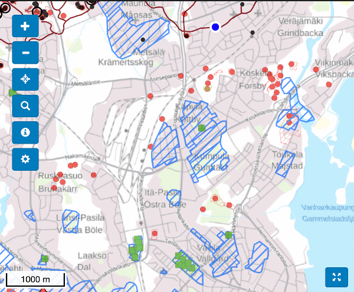
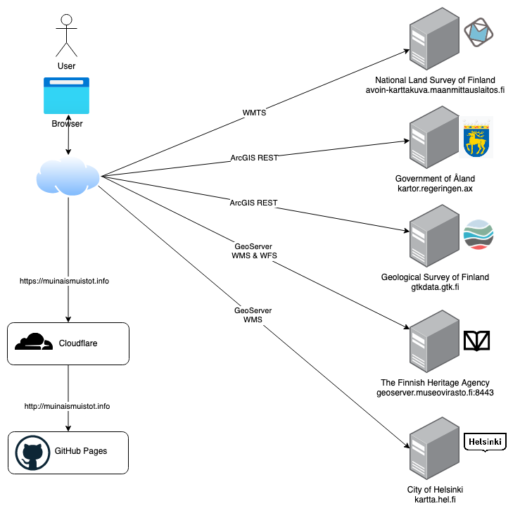

# Muinaismuistot.info

A web page to show ancient monuments of Finland in mobile friendly map.

## Main features

- Displays [Finnish Heritage Agency](https://www.museovirasto.fi/en) and [Government of Åland](https://www.regeringen.ax/kulturarv/arkeologi-fornlamningar/fornlamningsregistret) ancient monuments open data on map from the [National Land Survey of Finland](https://www.maanmittauslaitos.fi/en)
- Scales from mobile device to desktop screen
- Get more info from sites by clicking it
- Select background map type (background map, topografic map, aerial image)
- Displays your current location on map if you allow it
- Search sites by search term
- Filter sites on map by type and dating
- Share selected site map coordinates and filter settings by copying the URL
- UI test translations to finnish and swedish
- Displays linked ancient monuments 3D models from [Sketchfab](https://sketchfab.com)
- Shows data latest update dates from source servers

## Data

- [National Land Survey of Finland](https://www.maanmittauslaitos.fi/en)
  - Background map, topografic map and aerial image [open map data](https://www.maanmittauslaitos.fi/en/maps-and-spatial-data/expert-users/topographic-data-and-how-acquire-it)
  - Free to use [WMTS Map tile API](https://avoin-karttakuva.maanmittauslaitos.fi/avoin/wmts/1.0.0/WMTSCapabilities.xml)
  - Map data licence is [Creative Commons CC By 4.0](https://creativecommons.org/licenses/by/4.0/)
- [Finnish Heritage Agency](https://www.museovirasto.fi/en)
  - Ancient monuments and architectural heritage [open map data](https://www.museovirasto.fi/fi/palvelut-ja-ohjeet/tietojarjestelmat/kulttuuriympariston-tietojarjestelmat/kulttuuriympaeristoen-paikkatietoaineistot)
  - Free to use [ArcGIS WMS Map tile REST API](https://kartta.nba.fi/arcgis/rest/services/WMS/MV_KulttuuriymparistoSuojellut/MapServer)
  - Map data licence is [Creative Commons CC By 4.0](https://creativecommons.org/licenses/by/4.0/)
- [Government of Åland](https://www.regeringen.ax/kulturarv/arkeologi-fornlamningar/fornlamningsregistret)
  - Ancient monuments [open map data](https://www.kartor.ax/datasets/aland::fornminnen/about)
  - Free to use [ArcGIS WMS Map tile REST API](https://kartor.regeringen.ax/arcgis/rest/services/Kulturarv/Fornminnen/MapServer)
  - Map data licence is [Creative Commons CC By 4.0](https://creativecommons.org/licenses/by/4.0/)
- [Geological Survey of Finland](https://www.gtk.fi/en/front-page/)
  - [Ancient shorelines](https://tupa.gtk.fi/paikkatieto/meta/ancient_shorelines.html)
  - [ArcGIS WMS Map tile REST API](https://gtkdata.gtk.fi/arcgis/rest/services/Rajapinnat/GTK_Maapera_WMS/MapServer/7)
  - Restricted [base licence](https://www.gtk.fi/peruslisenssi/), permission to use the API on this site acquired at 15.1.2021.
- [Helsinki Urban Environment Division](https://www.hel.fi/kaupunkiymparisto/en)
  - Fortifications on land during First World War in Helsinki [open map data](<(https://hri.fi/data/en_GB/dataset/helsingin-ensimmaisen-maailmansodan-aikaiset-maalinnoitukset)>)
  - Free to use [WMS Map tile API](https://kartta.hel.fi/ws/geoserver/avoindata/wms)
  - Map data licence is [Creative Commons CC By 4.0](https://creativecommons.org/licenses/by/4.0/)
- [Own 3D models database](https://muinaismuistot.info/3d/)
  - Links [Sketchfab](https://sketchfab.com) 3D models to ancient monuments location and register info to map
  - Free to use [GeoJSON file](https://muinaismuistot.info/3d/3d.json)
  - Every 3D model has separate licence
- [Own "Maiseman muisti" book ancient monuments database](https://muinaismuistot.info/maisemanmuisti/)
  - "Maiseman muisti" book (Finnish Heritage Agency, 2001) ancient monuments locations
  - Free to use [GeoJSON file](https://muinaismuistot.info/maisemanmuisti/maisemanmuisti.json)
  - Permission asked from Finnish Heritage Agency to list the ancient monuments included in the book

## Version history

See [GitHub releases](https://github.com/anttikekki/muinaismuistot/releases)

## Licence

[MIT License](https://github.com/anttikekki/muinaismuistot/blob/master/LICENSE)

## Technologies

- UI
  - [TypeScript](https://www.typescriptlang.org/)
  - [OpenLayers](https://openlayers.org/)
  - [React](https://reactjs.org/)
  - [Redux](https://redux.js.org/)
  - [Redux Observable](https://redux-observable.js.org/)
  - [RxJS](https://rxjs.dev/)
  - [Bootstrap](https://getbootstrap.com/docs/3.3/)
  - [React i18next](https://react.i18next.com/)
- Build
  - [Node.js](https://nodejs.org/en/)
  - [Webpack](https://webpack.js.org/)
- Infrastucture
  - [GitHub pages](https://pages.github.com/)
  - [Cloudflare](https://www.cloudflare.com)
  - [AWS Lambda](https://aws.amazon.com/lambda/)

## Infrastructure

The whole UI is just static `html` and `js` files from Webpack build that are hosted in [GitHub pages](https://pages.github.com/) of this repository: [https://anttikekki.github.io/muinaismuistot](https://anttikekki.github.io/muinaismuistot). [Cloudflare](https://www.cloudflare.com) is used as a reverse proxy to add HTTPS support.

There is no hosted backend server. Browser calls directly data providers map servers to fetch map tile images and data. One [AWS Lambda](https://aws.amazon.com/lambda/) is used as reverse proxy to add [CORS headers](https://en.wikipedia.org/wiki/Cross-origin_resource_sharing#Headers) to request to [http://paikkatieto.nba.fi/aineistot/MV_inspire_atom.xml](http://paikkatieto.nba.fi/aineistot/MV_inspire_atom.xml) so that UI in browser can acces it from different domain.

## Development environment

### Requirements

- [Node.js](https://nodejs.org/en/) 12 or 14 or later installed
- Only MacOS is tested, Linux should also work. `package.json`scripts use `PARAM=value` type parameters that require different syntax on Windows.

### Environment setup

1. Install Node.js
2. Clone this repository
3. Run `npm install`

### Commands

### `npm run dev`

Runs UI locally with [webpack dev server](https://webpack.js.org/configuration/dev-server/). Opens system default browser to [https://localhost:8091](https://localhost:8091). The UI refreshes automatically after code changes.

### `npm run prod`

Same as `npm run dev` but uses production build with code minication.

### `npm run build:dev`

Builds development version of the UI with webpack to `./dist` folder without code minification and with Redux dev tools support.

### `npm run build:prod`

Builds production version of the UI with webpack to `./dist` folder with code minification and without Redux dev tools support.

### `npm run profile-size`

Runs [webpack bundle analyzer](https://github.com/webpack-contrib/webpack-bundle-analyzer) and opens it's UI to system default browser. Handy tool to analyze what libraries are included in the final build result.
