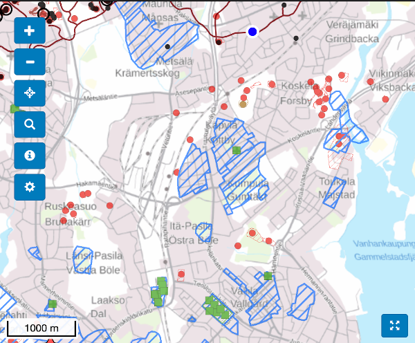

# Muinaismuistot.info

[Muinaismuistot.info](https://muinaismuistot.info/) on mobiiliystävällinen karttapalvelu, jossa voi tutkia Suomen arkeologista ja rakennettua kulttuuriperintöä. Palvelu yhdistää Museoviraston, Ahvenanmaan maakuntahallinnon ja muiden avointen paikkatietolähteiden aineistoja samaan OpenLayers-karttaan.



## Ominaisuudet

- Museoviraston kulttuuriympäristörekisterien ja Ahvenanmaan muinaisjäännösten näyttäminen kartalla
- kohteiden tunnistaminen kartalta, tietojen tarkastelu, haku ja GeoJSON-vienti
- muinaisjäännösten suodatus tyypin ja ajoituksen mukaan
- jaettavat kohde-, kartta- ja suodatuslinkit
- valittavat tausta-, maasto-, ilmakuva- ja historialliset karttatasot
- käyttäjän nykyisen sijainnin näyttäminen luvan perusteella
- Museoviraston aineiston PMTiles-pohjainen vektorikartta sekä WMS/WFS-varatoteutus
- Maannousu.info-, GTK-, Helsinki- ja Viabundus-karttatasot
- kohteisiin linkitetyt 3D-mallit ja Maiseman muisti -kirjan kohteet
- suomen-, ruotsin- ja englanninkielinen käyttöliittymä
- mobiili- ja työpöytänäytöille mukautuva käyttöliittymä

## Arkkitehtuuri

React- ja OpenLayers-sovellus rakennetaan Webpackilla staattisiksi tiedostoiksi. Cloudflare Worker palvelee ne Workers Static Assetsista ja tarjoaa samalla selaimen käyttämän `/api/museovirasto/*`-rajapinnan.

Museoviraston aineistoa ei normaalissa käytössä haeta suoraan WMS/WFS-palvelusta. Päivittäinen aineistoputki muuntaa ladattavan GeoPackage-aineiston karttarenderöintiä varten PMTiles-arkistoksi ja kohdetietoja, hakua sekä karttaklikkausta varten D1-tietokannaksi. PMTiles ja julkaisumetadata sijaitsevat Cloudflare R2:ssa. Muut kartta-aineistot selain hakee niiden tarjoajien WMTS-, WMS-, ArcGIS REST-, GeoTIFF- tai GeoJSON-rajapinnoista.

```text
Museoviraston tutkija.zip
          |
          v
Cloudflare Workflow + Container
  validointi ja prosessointi
          |
          +----> PMTiles ja metadata ----> Cloudflare R2
          |
          +----> kohdetiedot ja haku ----> Cloudflare D1
                                             |
Selain ----> Cloudflare Worker + Static Assets
                  |
                  +----> /api/museovirasto/pmtiles
                  +----> /api/museovirasto/search
                  +----> /api/museovirasto/features/*
                  +----> /api/museovirasto/meta ja /health
                  |
                  +----> R2 ja D1

Selain ----> muut ulkoiset WMTS/WMS/ArcGIS/GeoTIFF-palvelut
```

Museoviraston WMS/WFS-toteutus on säilytetty erillisenä varatoteutuksena ja ulkoisen palvelun monitorointia varten.

Tarkempi dokumentaatio:

- [Museoviraston karttadatan prosessointi, julkaisu ja operointi](./infra/museovirasto-map-data/README.md)
- [Cloudflare Worker, Static Assets ja Museovirasto-API](./infra/muinaismuistot-worker/README.md)
- [Selainpohjaiset end-to-end-testit](./e2e/README.md)

## Museoviraston aineistoputki

Production-updater suoritetaan päivittäin:

1. Updater käynnistää Cloudflare Containerin, joka lataa Museoviraston `tutkija.zip`-aineiston.
2. Lähteen rakenne, geometriat, koordinaatisto ja tunnetut arvojoukot validoidaan.
3. Karttarenderöintiä varten rakennetaan kompakti PMTiles-arkisto.
4. Hakua, identify-toimintoa, kohdetietoja ja pysyviä linkkejä varten rakennetaan D1-tuonti.
5. PMTiles- ja D1-aineistojen feature-identiteetit ristiinvalidoidaan.
6. D1-migraatiot ja tuonti suoritetaan, minkä jälkeen PMTiles ja metadata julkaistaan R2:een.
7. Julkaistu API ja keskeiset selainpolut smoke-testataan.

Workflow hälyttää epäonnistuneesta ajosta. Erillinen tuoreustarkistus valvoo, ettei tuotannossa oleva aineisto vanhene.

## Projektin rakenne

```text
src/                              React/OpenLayers-sovellus
e2e/                              Playwright-selaintestit
infra/
├── muinaismuistot-worker/        Static Assets ja julkinen API
└── museovirasto-map-data/
    ├── contract/                 Yhteiset skeemat ja tasomääritykset
    ├── processing/               Validointi ja artefaktien rakentaminen
    ├── deploy/                   R2- ja D1-julkaisu
    └── updater/                  Päivittäinen Workflow ja Container
scripts/                          Paikallisen kehityksen apuskriptit
docs/                             Kuvat ja muu dokumentaatio
```

## Aineistot ja lisenssit

| Toimittaja | Aineisto | Käyttötapa | Lisenssi |
| --- | --- | --- | --- |
| [Museovirasto](https://www.museovirasto.fi/fi/palvelut-ja-ohjeet/tietojarjestelmat/kulttuuriympariston-tietojarjestelmat/kulttuuriympaeristoen-paikkatietoaineistot) | Kulttuuriympäristörekisterit | Päivittäinen GeoPackage-tuonti, PMTiles ja D1; WMS/WFS-varatoteutus | [CC BY 4.0](https://creativecommons.org/licenses/by/4.0/deed.fi) |
| [Maanmittauslaitos](https://www.maanmittauslaitos.fi/kartat-ja-paikkatieto/asiantuntevalle-kayttajalle/kartta-ja-paikkatietojen-rajapintapalvelut-17) | Tausta-, maasto- ja ilmakuvat | WMTS | [CC BY 4.0](https://creativecommons.org/licenses/by/4.0/deed.fi) |
| [Maanmittauslaitos / CSC Paituli](https://paituli.csc.fi/webservices.html) | Vanhat kartat | WMS | [CC BY 4.0](https://creativecommons.org/licenses/by/4.0/deed.fi) |
| [Ahvenanmaan maakuntahallinto](https://www.kartor.ax/datasets) | Muinaisjäännökset | ArcGIS REST | [CC BY 4.0](https://creativecommons.org/licenses/by/4.0/deed.fi) |
| [Geologian tutkimuskeskus](https://www.gtk.fi/palvelut/aineistot-ja-verkkopalvelut/rajapintapalvelut/maapera-karttatasot-wms-rajapinnassa/) | Muinaisrannat ja maaperä | ArcGIS REST | [GTK:n peruslisenssi](https://www.gtk.fi/peruslisenssi/) ja [CC BY 4.0](https://creativecommons.org/licenses/by/4.0/deed.fi); muinaisrantojen käyttölupa saatu 15.1.2021 |
| [Maannousu.info](https://maannousu.info/integration) | Maannousua kuvaavat kartat | GeoTIFF API | [CC BY 4.0](https://creativecommons.org/licenses/by/4.0/deed.fi) |
| [Helsingin kaupunki](https://hri.fi/data/fi/dataset/helsingin-ensimmaisen-maailmansodan-aikaiset-maalinnoitukset) | Ensimmäisen maailmansodan maalinnoitukset | WMS | [CC BY 4.0](https://creativecommons.org/licenses/by/4.0/deed.fi) |
| [Viabundus](https://www.landesgeschichte.uni-goettingen.de/handelsstrassen/info.php?lang=fin) | Keskiaikainen tieverkko ja asutus | Repositorioon tuotu GeoJSON | [CC BY-SA 4.0](https://creativecommons.org/licenses/by-sa/4.0/deed.fi) |
| [Oma 3D-mallitietokanta](https://muinaismuistot.info/3d/) | Kohteisiin linkitetyt Sketchfab-mallit | [GeoJSON](https://muinaismuistot.info/3d/3d.json) | Mallikohtainen lisenssi |
| [Maiseman muisti](https://muinaismuistot.info/maisemanmuisti/) | Museoviraston vuonna 2001 julkaiseman kirjan kohteet | [GeoJSON](https://muinaismuistot.info/maisemanmuisti/maisemanmuisti.json) | Museovirastolta on pyydetty lupa kohdeluettelon julkaisemiseen |

## Teknologiat

- käyttöliittymä: TypeScript, React, Redux Toolkit, OpenLayers, Bootstrap ja i18next
- rakentaminen: Node.js ja Webpack
- selain- ja regressiotestit: Playwright
- infrastruktuuri: Cloudflare Workers, Static Assets, Workflows, Containers, R2 ja D1
- paikkatietojen prosessointi: Docker-pohjainen aineistoputki

## Kehitysympäristö

### Vaatimukset

- Node.js 22 tai uudempi; tarkka vaatimus on [`package.json`](./package.json)-tiedoston `engines`-kentässä.
- macOS on ensisijaisesti testattu kehitysympäristö. Linuxin pitäisi toimia. Osa `package.json`-komennoista käyttää Unix-tyylistä `NAME=value`-ympäristömuuttujasyntaksia.
- Paikallinen karttadatan prosessointi vaatii lisäksi Dockerin; tarkemmat vaatimukset ovat [updaterin README-tiedostossa](./infra/museovirasto-map-data/updater/README.md).

Asenna riippuvuudet:

```bash
git clone https://github.com/anttikekki/muinaismuistot.git
cd muinaismuistot
npm install
```

### Tavallisimmat komennot

| Komento | Tarkoitus |
| --- | --- |
| `npm run dev` | Käynnistää käyttöliittymän paikallisesti osoitteessa `https://localhost:8091` |
| `npm run dev:preview-api` | Käynnistää paikallisen käyttöliittymän Cloudflare-preview-APIa vasten |
| `npm run dev:prod-api` | Käynnistää paikallisen käyttöliittymän production-APIa vasten |
| `npm run build:dev` | Rakentaa development-version `dist/`-hakemistoon |
| `npm run build:prod` | Rakentaa minifioidun production-version `dist/`-hakemistoon |
| `npm run build:preview` | Rakentaa production-optimoidun preview-version hakukone-estoin |
| `npm run lint` | Suorittaa ESLint-tarkistuksen |
| `npm run test:e2e` | Suorittaa julkaisemisen estävät PMTiles/D1-E2E-testit |
| `npm run test:e2e:wms` | Suorittaa ulkoisesta GeoServeristä riippuvan WMS/WFS-monitorointitestin |
| `npm run test:e2e:all` | Suorittaa molemmat Playwright-testiprojektit |
| `npm run typecheck:e2e` | Tyyppitarkistaa Playwright-konfiguraation ja testit |
| `npm run worker:dev` | Käynnistää Cloudflare Workerin paikallisesti |
| `npm run worker:test` | Suorittaa Workerin testit |
| `npm run worker:typecheck` | Tyyppitarkistaa Workerin |
| `npm run profile-size` | Avaa Webpack Bundle Analyzerin |

PMTiles/D1-E2E-testit käyttävät oletuksena julkaistua preview-ympäristöä. Kohteen voi vaihtaa `E2E_BASE_URL`-ympäristömuuttujalla. Tarkemmat ohjeet ovat [E2E-testien dokumentaatiossa](./e2e/README.md).

## Ympäristöt ja julkaiseminen

| Ympäristö | Osoite |
| --- | --- |
| Production | [muinaismuistot.info](https://muinaismuistot.info) |
| Preview | [muinaismuistot-preview.antti-kekki.workers.dev](https://muinaismuistot-preview.antti-kekki.workers.dev) |

Preview- ja production-ympäristöillä on omat Worker-, R2- ja D1-resurssinsa. Worker-koodin ja staattisen sivuston julkaiseminen on eri operaatio kuin Museoviraston kartta-aineiston julkaiseminen. Uuden ympäristön käyttöönotto sekä turvallinen preview–production-julkaisujärjestys on kuvattu [Workerin README-tiedostossa](./infra/muinaismuistot-worker/README.md) ja [updaterin README-tiedostossa](./infra/museovirasto-map-data/updater/README.md).

## Lisenssi

Projektin lähdekoodi on julkaistu [MIT-lisenssillä](./LICENSE). Kartta- ja sisältöaineistoilla on omat yllä mainitut lisenssinsä.
